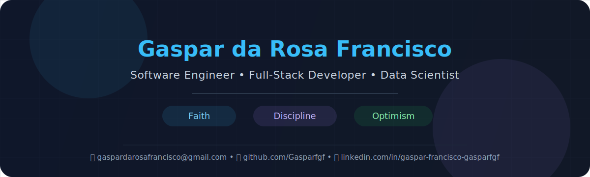

  

<!--
<h1 align="center">Hi , i'm Gaspar Francisco</h1>
<h3 align="center">Software Engineer | Full-Stack Developer | Problem Solver</h3>
🌍 -->

---

Passionate about building scalable applications, clean architectures and user-centered digital experiences,
 i enjoy combining strong technical foundations with communication, collaboration, and continuous learning.

<table align="right">
 <tr><td> Choose Your Language</td></tr>
 <tr><td>🇬🇧 <a href="README.md">English</a></td></tr>
 <tr><td>🇪🇸 <a href="README.md">Español</a></td></tr>
 <tr><td>🇫🇷 <a href="README_fr.md">Français</a></td></tr>
 <tr><td>🇵🇹 <a href="README_pt.md">Português</a></td></tr>
</table>

---

 
  
<h2>👨‍💻 About me</h2>

 <h3>📄 Quick informations</h3>

- 🔭 I’m currently working on 

- 🌱 I’m currently learning **Apache Airflow and Data Science**

- :space_invader:&nbsp;All of my projects are available at 
<!--
- 📝 I regularly write articles on [https://www.linkedin.com/in/gaspar-francisco-5a4639203/](https://www.linkedin.com/in/gaspar-francisco-5a4639203/)-->
<!--
- 💬 Ask me about **Java, Design Patterns**-->

- 📫 [How to reach me](#connect-with-me)
<!--
- 📄 Know about my experiences [https://www.linkedin.com/in/gaspar-francisco-gasparfgf/](https://www.linkedin.com/in/gaspar-francisco-5a4639203/)-->

- 🎯 My goal is to build useful things as a senior full-stack software engineer and a data scientist.

* ⚡ Fun fact ***You can hate computers and end up loving them and making them your passion.***

* 🤝 Strong believer in collaboration and non-violent communication

* 🐧 Linux is the best

* 💓 Interested in backend engineering, frontend UX, DevOps, and data analysis / visualization

<h3>:brain: &nbsp;My Engineering Philosophy</h3>

* **Non-Violent Communication** — I believe clear, empathetic dialogue is foundational to productive engineering teams.

* **Clean Code by Design** — Readable, well-structured code is not a luxury — it is a professional standard.

* **Continuous Learning** — The field evolves constantly. Staying curious and humble is part of the craft.

* **Collaboration Over Competition** — The best solutions emerge from teams that listen, share knowledge, and build trust.

---

## &nbsp;&nbsp; 

  

---

 
  
<h2>:computer: &nbsp;Technical stack</h2>

<h3>☄️ Application Server and OS</h3>

   . 
   · 
   · 
  

<h3>🏢 Architecture</h3>

   · 
   · 
   · 
   · 
  

<h3>🚀 Backend</h3>

   · 
   · 
   · 
   · 
   · 
   · 
   · 
   · 
   · 
   

<h3>🔍 Data Analytics (visualization) | Data Scientist</h3>

   · 
   · 
  . 
   · 
   · 
  

<h3>🗄️ Database</h3>

   · 
   · 
   

<h3>⚡ DevOps</h3>

   · 
  

<h3>📺 Frontend</h3>

   · 
   · 
   · 
   · 
   · 
   · 
   · 
  

<h3>✍️ Languages</h3>

  · 
   · 
   · 
  . 
  

<h3>🧰 Methodologies</h3>

   · 
   · 
  

<h3>🛠️ Tools</h3>

* **⚙️ Integrated Development Environment (IDE)**

   · 
   · 
   · 
   · 
  
 <!---->

* **✨ Versionning**

   · 
   · 
  

* **Others**:

  · 
   · 
   . 
  <!-- . 
 -->

---

 
  
<h2>:computer: &nbsp;Technical stack (eventually) used</h2>

These are technologies i had contact with (using or learning) :

* **🗄️ Database**:

   · 
  

* **📺 Frontend**:

 

* **✍️ Language**:

   · 
   · 
   · 
   · 
   · 
   · 
   · 
  

* **Mobile**:

   · 
  

* **Others**:

   · 
   · 
   

 
  
<h2>📊 GitHub Statistics</h2>

   

 <!---->
 

  

  
More stats

  

 
 

<!--

-->
  

---

## &nbsp;&nbsp; 

  

---

## &nbsp;&nbsp;Connect with me

  &nbsp;&nbsp;&nbsp;&nbsp;
  &nbsp;&nbsp;&nbsp;&nbsp;

---

  Last updated · 16 / 05 / 2026 · Open to collaborations & opportunities

<!--

 

## Hi there 👋

**Gasparfgf/Gasparfgf** is a ✨ _special_ ✨ repository because its `README.md` (this file) appears on your GitHub profile.

Here are some ideas to get you started:

- 🔭 I’m currently working on ...
- 🌱 I’m currently learning ...
- 👯 I’m looking to collaborate on ...
- 🤔 I’m looking for help with ...
- 💬 Ask me about ...
- 📫 How to reach me: ...
- 😄 Pronouns: ...
- ⚡ Fun fact: ...
-->
