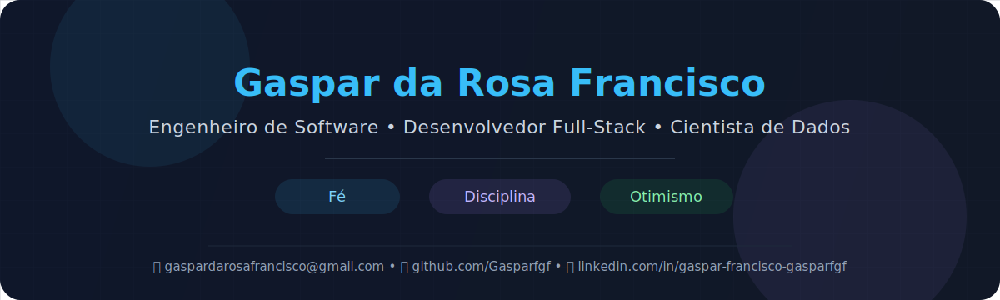

  

<!--
<h1 align="center">Hi , i'm Gaspar Francisco</h1>
<h3 align="center">Software Engineer | Full-Stack Developer | Problem Solver</h3>
🌍 -->

---

Apaixonado por criar aplicações escaláveis, arquiteturas limpas e experiências digitais centradas no utilizador,
gosto de combinar bases técnicas sólidas com comunicação, colaboração e aprendizagem contínua.

<table align="right">
 <tr><td> Escolha o seu idioma</td></tr>
 <tr><td>🇬🇧 <a href="../README.md">Inglês</a></td></tr>
 <tr><td>🇪🇸 <a href="README_es.md">Espanhol</a></td></tr>
 <tr><td>🇫🇷 <a href="README_fr.md">Francês</a></td></tr>
</table>

---

 
  
<h2>👨‍💻 Sobre mim</h2>

 <h3>📄 Informações rápidas</h3>

- 🔭 Atualmente estou a trabalhar em 

- 🌱 Atualmente estou a aprender **Apache Airflow e Ciência de Dados**.

- :space_invader:&nbsp;Todos os meus projetos estão disponíveis em 
<!--
- 📝 I regularly write articles on [https://www.linkedin.com/in/gaspar-francisco-5a4639203/](https://www.linkedin.com/in/gaspar-francisco-5a4639203/)-->
<!--
- 💬 Ask me about **Java, Design Patterns**-->

- 📫 [Como entrar em contacto comigo](#conecte-se-comigo)
<!--
- 📄 Know about my experiences [https://www.linkedin.com/in/gaspar-francisco-gasparfgf/](https://www.linkedin.com/in/gaspar-francisco-5a4639203/)-->

- 🎯 O meu objetivo é construir coisas úteis como engenheiro de software full-stack sénior e ajudar as organizações a tomar decisões estratégicas como cientista e analista de dados.

* ⚡ Curiosidade: ***Podes odiar os computadores e acabar por amá-los e fazer deles a sua paixão.***

* 🤝 Acredito firmemente na colaboração e na comunicação não violenta.

* 🐧 O Linux é o melhor.

* 💓 Tenho interesse em engenharia de backend, UX de frontend, DevOps e análise/visualização de dados.

<h3>:brain: &nbsp;A minha filosofia de engenharia</h3>

* **Comunicação Não Violenta** — Acredito que o diálogo claro e empático é fundamental para equipas de engenharia produtivas.

* **Código limpo por design** — O código legível e bem estruturado não é um luxo — é um padrão profissional.

* **Aprendizagem contínua** — A área está em constante evolução. Manter a curiosidade e a humildade faz parte da profissão.

* **Colaboração em vez de competição** — As melhores soluções surgem de equipas que ouvem, partilham conhecimento e criam confiança.

---

## &nbsp;&nbsp; 

  

---

 
  
<h2>:computer: &nbsp;Conjunto técnico</h2>

<h3>☄️ Servidor de aplicações e sistema operativo</h3>

   . 
   · 
   · 
  

<h3>🏢 Arquitetura</h3>

   · 
   · 
   · 
   · 
  

<h3>🚀 Backend</h3>

   · 
   · 
   · 
   · 
   · 
   · 
   · 
   · 
   · 
   

<h3>🔍 Análise de Dados (visualização) | Ciência de Dados</h3>

   · 
   · 
  . 
   · 
   · 
  

<h3>🗄️ Banco de dados</h3>

   · 
   · 
   

<h3>⚡ DevOps</h3>

   · 
  

<h3>📺 Frontend</h3>

   · 
   · 
   · 
   · 
   · 
   · 
   · 
  

<h3>✍️ Linguagens de programação</h3>

  · 
   · 
   · 
  . 
  

<h3>🧰 Metodologias</h3>

   · 
   · 
  

<h3>🛠️ Ferramentas</h3>

* **⚙️ Ambientes de Desenvolvimento Integrado**

   · 
   · 
   · 
   · 
  
 <!---->

* **✨ Controlo de versões**

   · 
   · 
  

* **Outros**

  · 
   · 
   . 
  <!-- . 
 -->

---

 
  
<h2>:computer: &nbsp;Conjunto de tecnologias (eventualmente) utilizado</h2>

São tecnologias com as quais tive contacto (usando ou aprendendo) :

* **🗄️ Banco de dados**:

   · 
  

* **📺 Frontend**:

 

* **✍️ Linguagens de programação**:

   · 
   · 
   · 
   · 
   · 
   · 
   · 
  

* **Móvel**:

   · 
  

* **Outras**:

   · 
   · 
   

 
  
<h2>📊 Estatísticas do GitHub</h2>

   

 <!---->
 

  

  
Mais estatísticas

  

 
 

<!--

-->
  

---

## &nbsp;&nbsp; 

  

---

## &nbsp;&nbsp;Conecte-se comigo

  &nbsp;&nbsp;&nbsp;&nbsp;
  &nbsp;&nbsp;&nbsp;&nbsp;

---

  Last updated · 16 / 05 / 2026 · Open to collaborations & opportunities

<!--

 

## Hi there 👋

**Gasparfgf/Gasparfgf** is a ✨ _special_ ✨ repository because its `README.md` (this file) appears on your GitHub profile.

Here are some ideas to get you started:

- 🔭 I’m currently working on ...
- 🌱 I’m currently learning ...
- 👯 I’m looking to collaborate on ...
- 🤔 I’m looking for help with ...
- 💬 Ask me about ...
- 📫 How to reach me: ...
- 😄 Pronouns: ...
- ⚡ Fun fact: ...
-->
